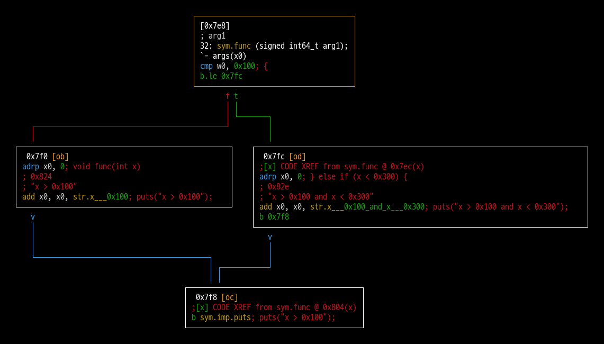

## Chapter 9: Understanding Basic Static Analysis

### The else-if statement
```c
void func(int x)
{
    if (x > 0x100) {
        puts("x > 0x100");
    } else if (x < 0x300) {
        puts("x > 0x100 and x < 0x300");
    } else {
        puts("x is else");
    }
}
```
- 위 코드에는 의도한 건지는 모르겠지만, 버그로 보이는 부분이 있다.
  - **"x is else"** 는 절대 출력될 수 없다.
  - Radare2를 이용해 Function Graph를 그려 보면, **"x is else"** 를 출력하는 코드가 컴파일러에 의해 삭제된 걸 확인 할 수 있다. (Unreachable Code)


