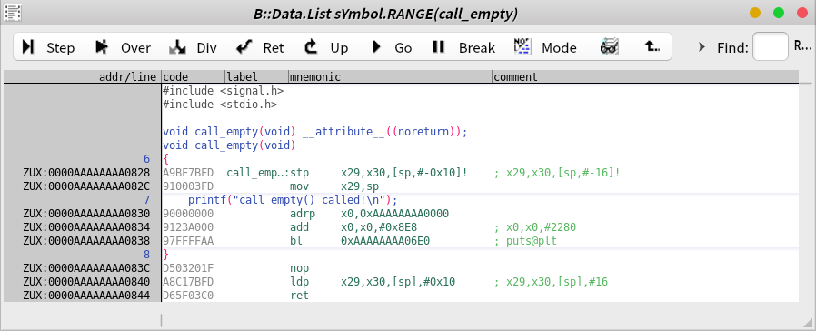
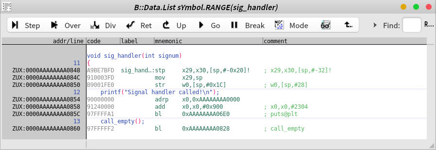
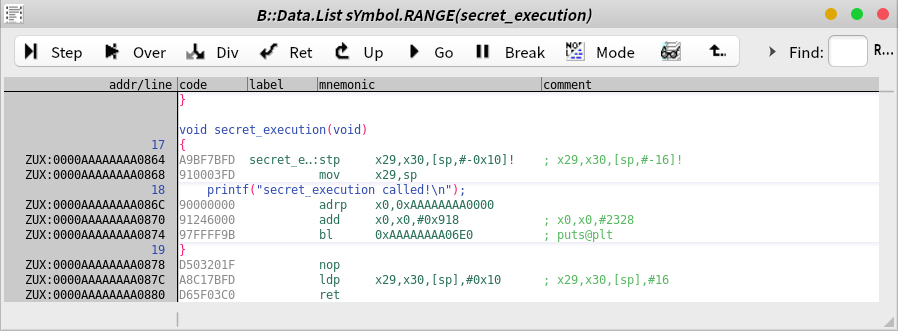
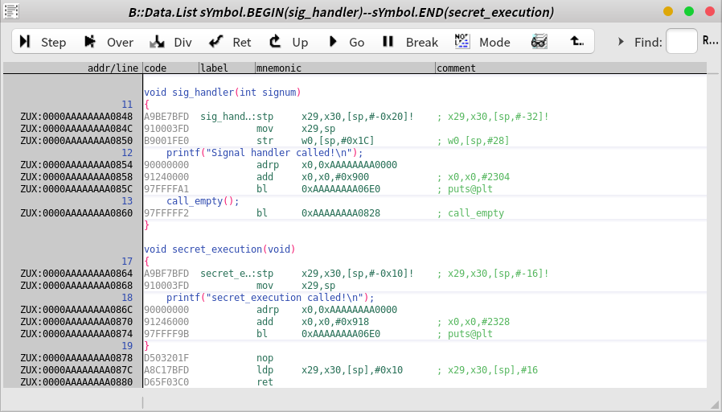

## Chapter 11: Analyzing Program Behavior with Basic Dynamic Analysis

### Return-oriented programming analysis

#### `__attribute__((noreturn))` or `__noreturn`
- `call_empty`
  - `__noreturn` 속성을 가진 `call_empty` 함수는 `ret`를 호출한다.
  - `__noreturn` 속성은 컴파일러에게 **'이 함수는 리턴하지 않음'** 이라고 알려주는 것이지마, `ret`를 호출하고 있으므로 아래와 같은 빌드 경고를 출력한다.
```
ROP_practice_code.c: In function ‘call_empty’:
ROP_practice_code.c:8:1: warning: ‘noreturn’ function does return
    8 | }
      | ^
```



- `sig_handler`
  - `__noreturn` 속성을 가진 `call_empty` 함수를 호출하기 때문에, 컴파일러는 **`sig_handler`의 Function Epilog를 만들지 않는다.**
  - 즉, `sig_handler`는 `ret`를 호출하지 않는다.
  - `__noreturn` 속성은 **Caller**에 영향을 미친다.



- `secret_execution`
  - Radare2로 Cross-Reference를 확인해 보면, 다른 함수의 Callee가 아님을 확인할 수 있다.
```
[0xaaaaaaaa0700]> axt sym.call_empty
sym.sig_handler 0xaaaaaaaa0860 [CALL:--x] bl sym.call_empty
[0xaaaaaaaa0700]> axt sym.sig_handler
main 0xaaaaaaaa0890 [ICOD:r--] add x1, x0, sym.sig_handler
[0xaaaaaaaa0700]> axt sym.secret_execution
[0xaaaaaaaa0700]> 
```



#### `sig_handler` + `secret_execution`

- `call_empty` 에서 `sig_handler` 복귀할 때 `lr` 레지스터의 값은 `secret_execution` 의 시작 주소
- `secret_execution`의 Function Prolog `lr`을 스택에 보관한다.
- `secret_execution`의 Function Epilog 에서 `lr`을 스택으로부터 복원한다.
  - 이 때 `lr` 레지스터의 값은 `secret_execution`의 시작 주소 이므로 무한루프에 빠지게 된다.

```plantuml
participant "main" as A1
participant "sig_handler" as A2
participant "call_empty" as A3
participant "secret_execution" as A4

A1 -> A2 : raise(SIGUSR1)
A2 -> A3 : call_empty()
A3 -> A2 : ret
A2 --> A4 : two functions are concatenated
A4 -> A2 : ret
A2 --> A4 : two functions are concatenated
A4 -> A2 : ret
note right A2
infinite loop
endnote
```
