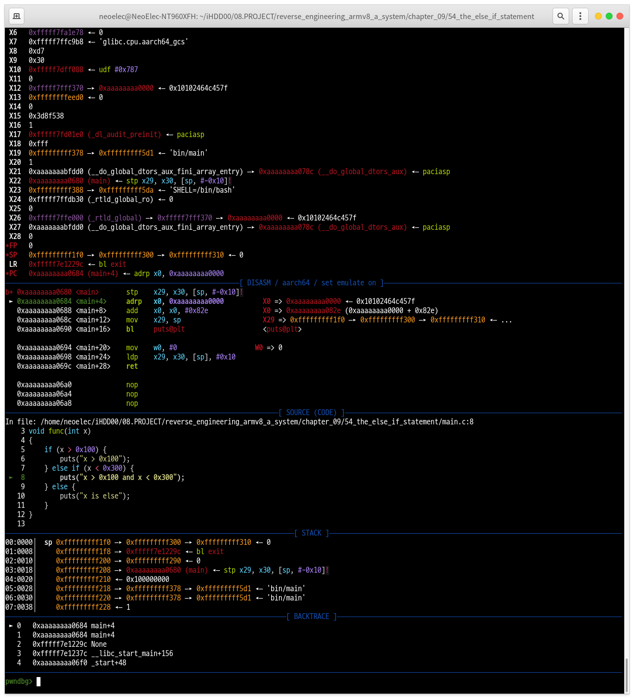

## Chapter 11: Analyzing Program Behavior with basic Dynamic Analysis

### Introducing GEF
- GEF 랑 비슷한 물건들 - 취향 것 골라 쓰면 된다.
  - [GEF - GDB Enhanced Features](https://github.com/hugsy/gef)
  - [GDB dashboard](https://github.com/cyrus-and/gdb-dashboard)
  - [PWNDBG](https://pwndbg.re/)

