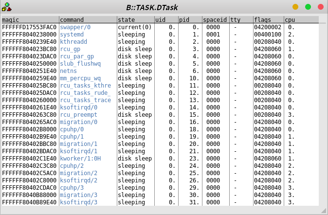
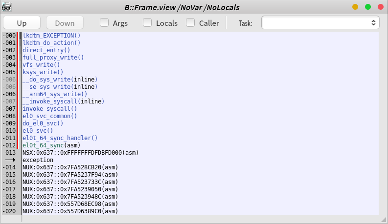
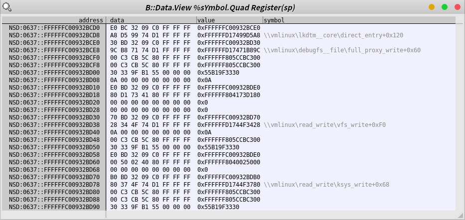
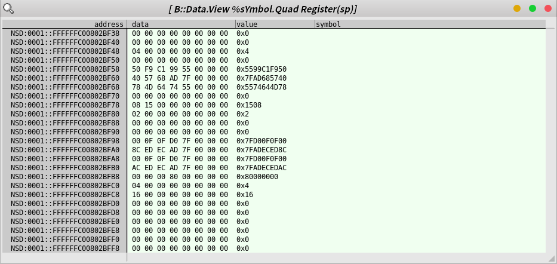
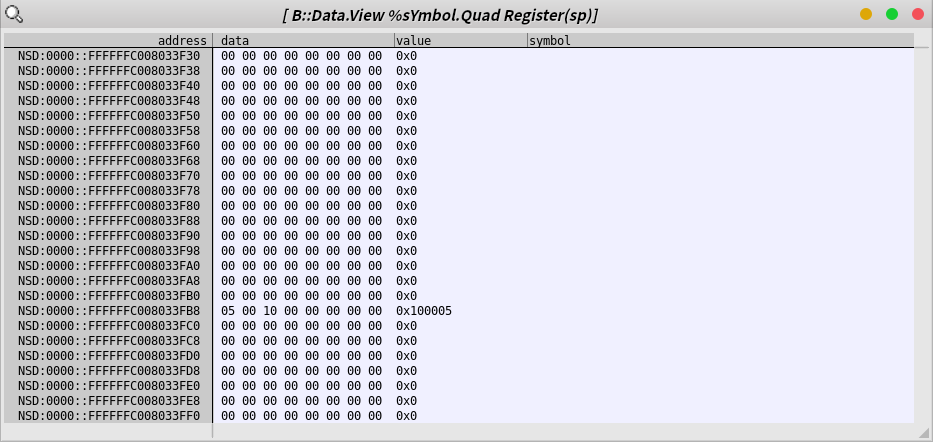
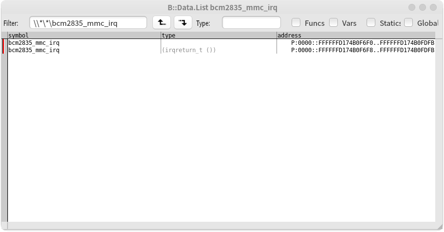
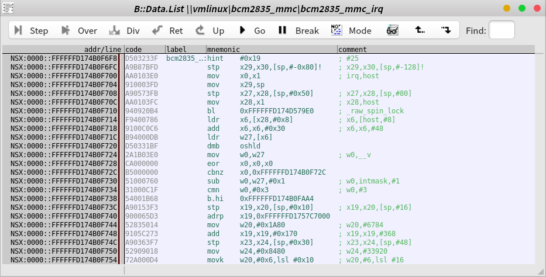
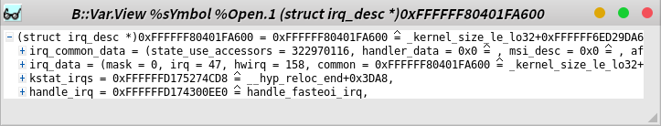

## Chapter 12: Expert Techniques in Advanced Dynamic Analysis

### Trace32
1. 00_RUNME.cmm 과 00_RUNME.emm 파일을 vmcore, vmlinux 있는 곳으로 복사. (vmlinux는 Chapter 10에 있는 것을 사용)
2. Trace32 를 실행하고. `DO 00_RUNME.cmm` 실행

### Enjoy!
- Trace32 에서 Back-Trace 확인

- Stack을 `Data.View` 명령을 통해 확인하는 방법도 있다.

- Figure 12.5: Stack signatures of a user process and a kernel process

- Finding the address of `bcm2835_mmc_irq`
  - Trace32 버그인가? 심볼을 중복 인식한다.

- Finding the address in the `irq_desc` structure

