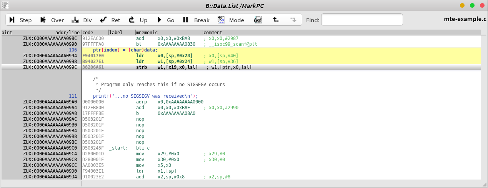
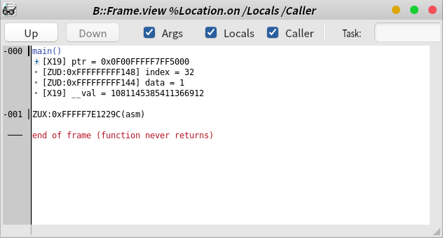

## Chapter 15: Building Defenses with Key Security Features of Armv8-A

### Memory Tagging Extension (MTE)
- 아쉽게도 책에서는 MTE의 예제는 소개하지 않는다.
- 구글링을 통해 찾은 예제
  - [ARM64 Reversing And Exploitation – Part 10 – Intro to Arm Memory Tagging Extension (MTE)](https://8ksec.io/arm64-reversing-and-exploitation-part-10-intro-to-arm-memory-tagging-extension-mte/)

### 테스트
```c
    ptr = (unsigned char *)insert_random_tag(ptr);

    /*
     * Set the key on the pointer to match the lock on the memory  (STG instruction)
     */
    set_tag(&ptr[0]);
    set_tag(&ptr[16]);

```
- 16 바이트 당 4 비트의 태그를 할당하고 적용한다. 따라서, 위 예제는 `ptr[31:0]` 영역이 동일한 태그를 사용하게 된다.
- index 가 **31** 이하인 경우 `SIGSEV`가 발생하지 않는다.
```
MTE is supported
pointer is 0xffff83c47000
pointer is now 0x500ffff83c47000
Enter the index to insert data : 0
Enter the data to insert : 1
...no SIGSEGV was received
make: *** [/home/debian/iHDD00/08.PROJECT/mk-raccoon/gcc_native.mk:17: run] Error 1
```

```
MTE is supported
pointer is 0xffffae453000
pointer is now 0x500ffffae453000
Enter the index to insert data : 31
Enter the data to insert : 2
...no SIGSEGV was received
make: *** [/home/debian/iHDD00/08.PROJECT/mk-raccoon/gcc_native.mk:17: run] Error 1
```
- index 가 **32** 이상인 경우 `SIGSEGV`가 발생한다.
```
MTE is supported
pointer is 0xffffa3b88000
pointer is now 0x500ffffa3b88000
Enter the index to insert data : 32
Enter the data to insert : 1
make: *** [/home/debian/iHDD00/08.PROJECT/mk-raccoon/gcc_native.mk:17: run] Segmentation fault
```

### Core Dump
- `strb` 명령이 실행될 때 태그 불일치 검출 (Sync Mode)



- 콜스택과 레지스터를 보면 태그와 문제가 발생한 주소를 확인할 수 있다.




